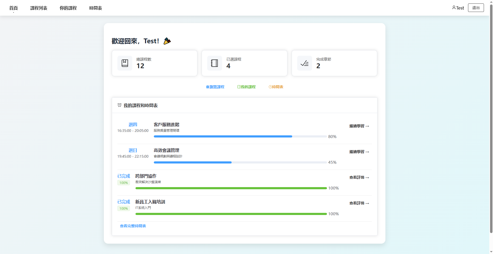

## 员工培训系统

這是一個用於公司內部員工培訓的網頁應用系統。系統允許管理員創建培訓課程及處理員工報名課程事宜，員工亦可瀏覽系統內的課程及其章節並跟踪學習進度和查看個人時間表。

## 目前此項目已經部署上線:staff-training-system.vercel.app即可使用
- 前端部分使用Vercel部署+後端使用GoogleCloudRun進行部署+SQL伺服器選擇TidbCloud

## 主要功能

- 用戶認證與授權(管理員/用戶)
- 課程管理與章節創建
- 顯示當前學習進度
- 課程報名與審批
- 可讀時間表

## 技術

本項目採用前後端分離架構開發並使用Restful API連接

### 前端: Vue框架 + ts

        --使用Pinia管理不同頁面的相應Store

        --使用element plus UI組件庫搭建前端UI畫面

        --使用 Axios 處理前後端通訊

        --JWT認證 用於為用戶進行身份驗證

### 後端: java spring

        --使用Spring Boot作為核心框架進行開發, 並使用Spring Security控制API訪問並提供,

          同時使用Spring Data JPA實行行自動化數據庫訪問層實現

        --Hibernate Orm進行Java和數據庫表的對象映射,實現JPA功能生成並執行SQL語句

        --使用BCrypt進行密碼加密

        --JWT令牌 進行用戶身份驗證與 Spring Security 集成的自定義認證過濾器

### 數據: MySQL

        --使用MySQL進行數據存儲供後端Hibernate ORM執行實際數據庫操作

### 部署: Maven + Vite + Git

        --Maven 進行後端建構與管理後端依賴的工具

        --npm/Vite 進行前端建構與管理package
        
        --Git 進行分佈式控制版本並發布Github

## 前置需求

要順利運行此項目 請先安裝下列必須環境變量及軟件

1.JAVA JDK 17 https://www.oracle.com/java/technologies/javase/jdk17-archive-downloads.html

2.Maven 3.9.9 https://maven.apache.org/download.cgi

3.Node.js 16+ https://nodejs.org/en

4.MySQL 8.0+ https://dev.mysql.com/downloads/installer/

## 本地運行步骤

安裝並配置好環境變量後完成以下步驟即可使用

1.打開CMD 輸入mysql -u root -p 輸入你的密碼

2.輸入 'SOURCE /your path/Staff_Training_System/init.sql' 以配置SQL

3.在後端/Back-end/src/main/resources/application.properties設置數據庫資料

4.在前端/Front-end/src/utils/request.ys及前端根目錄Vite.config.ts下配置你的後端地址 
  如http://localhost:8080

5.打開新的cmd 進入項目的後端部分 'cd /your path/Staff_Training_System/Back-end'

6.輸入 'mvn clean install' 後耐心等待

7.輸入 'mvn spring-boot:run' 以運行後端項目

8.打開新的cmd 進入項目的前端部分 'cd /your path/Staff_Training_System/Front-end'

9.輸入 'npm install' 以安裝前端依賴包

10.輸入 'npm run dev' 以運行前端項目

11.在前端項目輸入 'o + enter' 開啟網頁

## 配置说明

application.properties設置數據庫:

    spring.datasource.url=jdbc:mysql://localhost:3306/staff_training_system_database
    spring.datasource.username=root
    spring.datasource.password=你的MySQL密碼 需自行填寫
    spring.jpa.hibernate.ddl-auto=validate
    spring.jpa.show-sql=true

## 演示帳戶

系統預設了以下演示帳戶：

- 管理員: admin / admin123
- 一般用戶: Test / Test